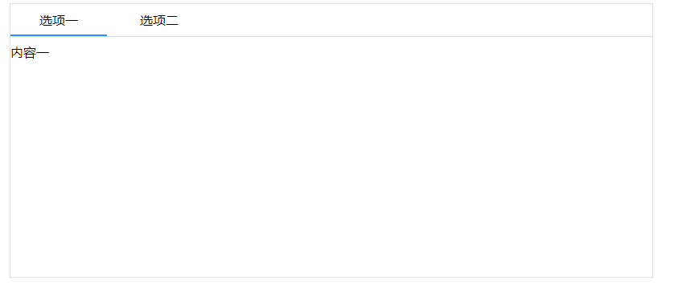

## react-tab



## API
### Tabs

| 参数      | 说明                                      | 类型         | 默认值 |
|----------|------------------------------------------|-------------|-------|
| activeIndex | 当前默认激活的tab索引 | number | 必填 |


### Tab
| 参数      | 说明                                      | 类型         | 默认值 |
|----------|------------------------------------------|-------------|-------|
| tab | tab名称 | string | 必填 |

### example
```javascript
const Demo = () => {
    const onTabChange = () => {
        //dosomething
    }

    return (
        <div style={{ width: "800px", margin: "auto"}}>
            <Tabs activeIndex={0} onTabChange={onTabChange}>
                <Tab tab="选项一">
                    内容一
                </Tab>
                <Tab tab="选项二">
                    内容二
                </Tab>
            </Tabs>
        </div>
    )
}
```

